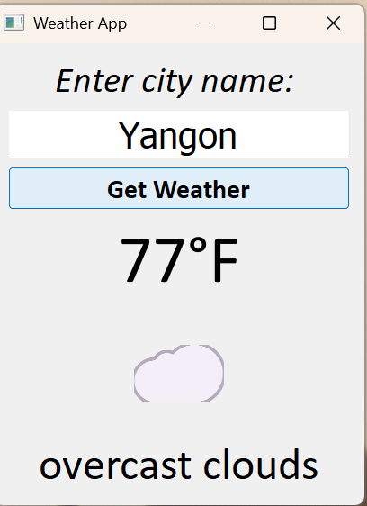

# 🌤️ Weather App  

A sleek **Python desktop app** built with **PyQt5** to check the current weather of any city in real-time.  

---

## 🚀 Features  

- 🌡️ Shows **temperature in °F**  
- 🌥️ Displays **weather description**  
- 😎 Shows **weather emojis** for clear, cloudy, rain, snow, storm, tornado, etc.  
- ⚡ Handles **connection and HTTP errors** gracefully  

---

## 📸 Screenshot  

 
